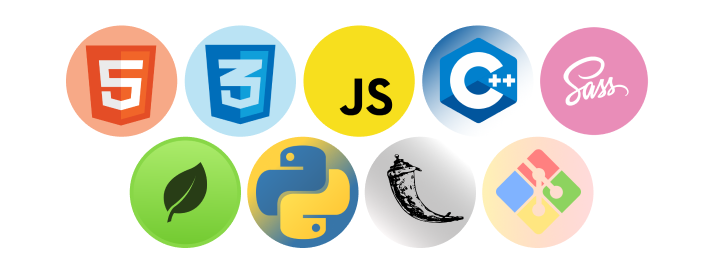

<h2 style = "text-align:center">
<!--  -->
Hi There👋
</h2>

I am <b>Priyanshu Saxena</b>  A tech geek trying to do better everyday in web development. 
👨‍🎓Studying at LPU (2019-23) | 💻 Learning ReactJS | 💬 Connect at <a href="https://www.linkedin.com/in/priyanshusaxena2612">@Linkedin</a>  

  

### Tech Stacks 

### Stats

### Highlights 

### Activity Graph

